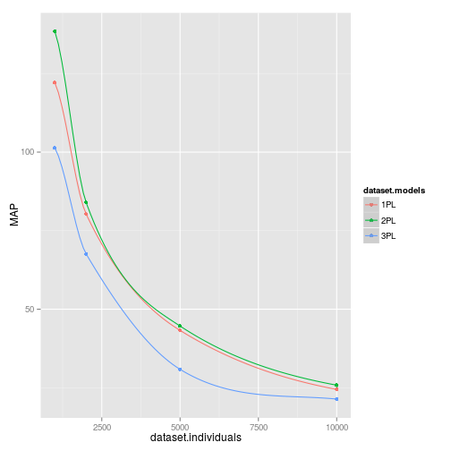
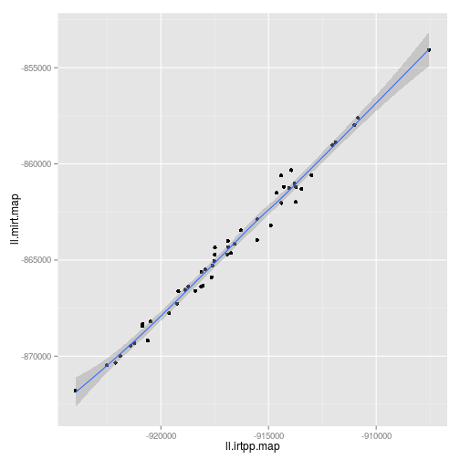

Comparacion de los paquetes IRTpp y MIRT para modelos unidimensionales
========================================================

Se compararon los paquetes **IRTpp** y **MIRT**, usando los valores por defecto de cada paquete, algunos de los parametros son :

#### IRTpp
* epsilon de convergencia : 0.00002
* Iteraciones maximas BFGS : 15
* Valores Iniciales : Metodo de Andrade

#### MIRT
* epsilon de convergencia : 0.00001
* Iteraciones BFGS : Algoritmo adaptativo
* Valores Iniciales : MIRT


## Escenarios de pruebas

Los siguientes escenarios de pruebas fueron considerados :


```
##       dataset.models dataset.items dataset.individuals
##  [1,] "1PL"          100           10000              
##  [2,] "1PL"          10            1000               
##  [3,] "1PL"          20            2000               
##  [4,] "1PL"          50            5000               
##  [5,] "2PL"          100           10000              
##  [6,] "2PL"          10            1000               
##  [7,] "2PL"          20            2000               
##  [8,] "2PL"          50            5000               
##  [9,] "3PL"          100           10000              
## [10,] "3PL"          10            1000               
## [11,] "3PL"          20            2000               
## [12,] "3PL"          50            5000
```

## Speedup y Tiempos

#### Tabla de speedups

```
##       dataset.models dataset.items dataset.individuals Estimacion
##  [1,] "1PL"          100           10000               0.8043309 
##  [2,] "1PL"          10            1000                19.1358   
##  [3,] "1PL"          20            2000                5.457581  
##  [4,] "1PL"          50            5000                2.116401  
##  [5,] "2PL"          100           10000               1.387647  
##  [6,] "2PL"          10            1000                11.67753  
##  [7,] "2PL"          20            2000                4.156149  
##  [8,] "2PL"          50            5000                2.443699  
##  [9,] "3PL"          100           10000               5.805688  
## [10,] "3PL"          10            1000                13.49596  
## [11,] "3PL"          20            2000                20.16917  
## [12,] "3PL"          50            5000                14.09623  
##       EAP       MAP     
##  [1,] 0.6286856 24.46091
##  [2,] 7.552989  122.0999
##  [3,] 2.324178  80.27191
##  [4,] 1.01496   43.23527
##  [5,] 0.6116914 25.80069
##  [6,] 3.575829  138.4676
##  [7,] 2.23532   83.96392
##  [8,] 0.9698576 44.62752
##  [9,] 0.465441  21.38497
## [10,] 2.760523  101.3315
## [11,] 1.452084  67.59496
## [12,] 1.091339  30.84445
```

#### Speedup en la estimacion

*Bajo la linea MIRT es mas rapido que IRTpp*

 

#### Speedup en EAP
*Bajo la linea MIRT es mas rapido que IRTpp*

 

#### Speedup en MAP
*Bajo la linea MIRT es mas rapido que IRTpp , en este caso la linea no alcanza a ser vista*


 

## Tiempos

#### Tabla de tiempos


```
##       dataset.models dataset.items dataset.individuals mirt     irtpp   
##  [1,] "1PL"          100           10000               2.8532   3.54774 
##  [2,] "1PL"          10            1000                0.42768  0.033335
##  [3,] "1PL"          20            2000                0.412825 0.0758  
##  [4,] "1PL"          50            5000                1.29586  0.61471 
##  [5,] "2PL"          100           10000               5.84846  4.21822 
##  [6,] "2PL"          10            1000                0.371065 0.04434 
##  [7,] "2PL"          20            2000                0.561675 0.135605
##  [8,] "2PL"          50            5000                2.23561  0.91653 
##  [9,] "3PL"          100           10000               47.65388 8.4123  
## [10,] "3PL"          10            1000                1.190255 0.12141 
## [11,] "3PL"          20            2000                3.66057  0.22583 
## [12,] "3PL"          50            5000                18.51232 1.46911 
##       m-eap    m-map    i-eap    i-map   
##  [1,] 2.5068   26.84008 3.988    1.09754 
##  [2,] 0.14547  0.81734  0.019725 0.007135
##  [3,] 0.36674  3.47409  0.158655 0.045055
##  [4,] 1.0167   11.06349 1.00231  0.25597 
##  [5,] 2.5327   27.13292 4.14066  1.05296 
##  [6,] 0.074625 0.97658  0.02085  0.007105
##  [7,] 0.3936   3.861165 0.176315 0.046085
##  [8,] 1.08572  12.62563 1.12     0.28327 
##  [9,] 2.42328  30.42788 5.20834  1.42456 
## [10,] 0.06756  0.8427   0.02449  0.00834 
## [11,] 0.301315 3.872315 0.209005 0.06582 
## [12,] 1.52596  11.70899 1.4225   0.57898
```

#### MIRT vs IRTpp , tiempos de estimacion

*Bajo la linea IRTpp tuvo un tiempo mas bajo que MIRT*


 


#### MIRT vs IRTpp , tiempos de EAP

*Bajo la linea IRTpp tuvo un tiempo mas bajo que MIRT*


 


#### MIRT vs IRTpp , tiempos de MAP

*Bajo la linea IRTpp tuvo un tiempo mas bajo que MIRT*


 

##Log verosimilitudes

#### Tabla de logverosimilitudes 

*Mas negativos se considera mejor (minimizando)*

*La ultimas columnas indican la proporcion de los que fueron minimos en el conjunto de experimentos*


```
##       dataset.models dataset.items dataset.individuals ll.irtpp.eap
##  [1,] "1PL"          100           10000               -918400     
##  [2,] "1PL"          10            1000                -3596       
##  [3,] "1PL"          20            2000                -34100      
##  [4,] "1PL"          50            5000                -227900     
##  [5,] "2PL"          100           10000               -878100     
##  [6,] "2PL"          10            1000                -3479       
##  [7,] "2PL"          20            2000                -33940      
##  [8,] "2PL"          50            5000                -223200     
##  [9,] "3PL"          100           10000               -949700     
## [10,] "3PL"          10            1000                -3447       
## [11,] "3PL"          20            2000                -33160      
## [12,] "3PL"          50            5000                -228300     
##       ll.mirt.eap ll.irtpp.map ll.mirt.map w.irtpp w.mirt
##  [1,] -864700     -917200      -864700     1       0     
##  [2,] -3409       -3591        -3409       1       0     
##  [3,] -32900      -33990       -32900      1       0     
##  [4,] -215100     -227300      -215100     1       0     
##  [5,] -872600     -876000      -872600     1       0     
##  [6,] -3460       -3462        -3460       1       0     
##  [7,] -33520      -33740       -33520      1       0     
##  [8,] -222900     -222300      -222900     0.97    0.03  
##  [9,] -809900     -940000      -809900     1       0     
## [10,] -3502       -3434        -3502       0.045   0.955 
## [11,] -31420      -32830       -31420      0.99    0.01  
## [12,] -201600     -225300      -201600     1       0
```

#### Log verosimilitud , metodo EAP

*Sobre la linea indica que IRTpp tuvo una menor logverosimilitud que MIRT*


 


#### Log verosimilitud , metodo MAP

*Sobre la linea indica que IRTpp tuvo una menor logverosimilitud que MIRT*


 


## Cercania a parametros poblacionales

A continuacion se detalla como se acercaron los parametros estimados a los parametros poblacionales


```
##       dataset.models dataset.items dataset.individuals a       b      
##  [1,] "1PL"          100           10000               "irtpp" "mirt" 
##  [2,] "1PL"          10            1000                "irtpp" "mirt" 
##  [3,] "1PL"          20            2000                "irtpp" "mirt" 
##  [4,] "1PL"          50            5000                "irtpp" "mirt" 
##  [5,] "2PL"          100           10000               "irtpp" "mirt" 
##  [6,] "2PL"          10            1000                "mirt"  "mirt" 
##  [7,] "2PL"          20            2000                "irtpp" "irtpp"
##  [8,] "2PL"          50            5000                "irtpp" "irtpp"
##  [9,] "3PL"          100           10000               "mirt"  "mirt" 
## [10,] "3PL"          10            1000                "irtpp" "irtpp"
## [11,] "3PL"          20            2000                "mirt"  "mirt" 
## [12,] "3PL"          50            5000                "mirt"  "mirt" 
##       c      
##  [1,] "irtpp"
##  [2,] "irtpp"
##  [3,] "irtpp"
##  [4,] "irtpp"
##  [5,] "irtpp"
##  [6,] "irtpp"
##  [7,] "irtpp"
##  [8,] "irtpp"
##  [9,] "irtpp"
## [10,] "mirt" 
## [11,] "mirt" 
## [12,] "irtpp"
```

```
## $a
## 
## irtpp  mirt 
##     4     4 
## 
## $b
## 
## irtpp  mirt 
##     3     5 
## 
## $c
## 
## irtpp  mirt 
##     2     2
```

```
##           irtpp-a      irtpp-b     irtpp-c
##  [1,] 0.000000000 0.0097954701 0.000000000
##  [2,] 0.000000000 0.0009041383 0.000000000
##  [3,] 0.000000000 0.0003851609 0.000000000
##  [4,] 0.000000000 0.0015585453 0.000000000
##  [5,] 0.008009260 0.0092439561 0.000000000
##  [6,] 0.006987940 0.0091618297 0.000000000
##  [7,] 0.001427794 0.0019494485 0.000000000
##  [8,] 0.004881142 0.0044550297 0.000000000
##  [9,] 0.063597366 0.1802555132 0.016494821
## [10,] 0.009143821 0.0096135408 0.003935445
## [11,] 0.004651412 0.0113272641 0.002662803
## [12,] 0.010672767 0.0225873910 0.006935525
```

```
##            mirt-a       mirt-b      mirt-c
##  [1,] 0.000000000 0.0053051474 0.000000000
##  [2,] 0.000000000 0.0006756141 0.000000000
##  [3,] 0.000000000 0.0003470963 0.000000000
##  [4,] 0.000000000 0.0013058941 0.000000000
##  [5,] 0.009001292 0.0089465538 0.000000000
##  [6,] 0.006979964 0.0091442628 0.000000000
##  [7,] 0.001441320 0.0019848097 0.000000000
##  [8,] 0.004922750 0.0045400535 0.000000000
##  [9,] 0.028216508 0.0578874556 0.019167559
## [10,] 0.010252351 0.0097018076 0.003833067
## [11,] 0.004150950 0.0092282066 0.002628287
## [12,] 0.008918215 0.0197040444 0.007253595
```


## Todas las logverosimilitudes EAP
 
 
 
 
 
 
 
 
 
 
 
 


## Todas las logverosimilitudes MAP
 
 
 
 
 
 
 
 
 
 
 
 
